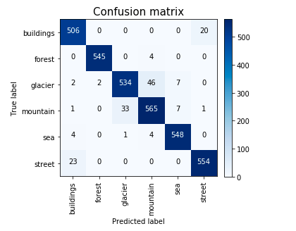
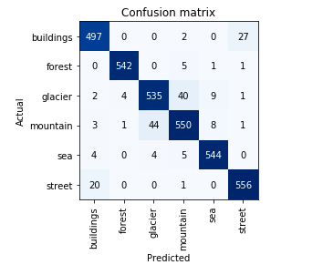
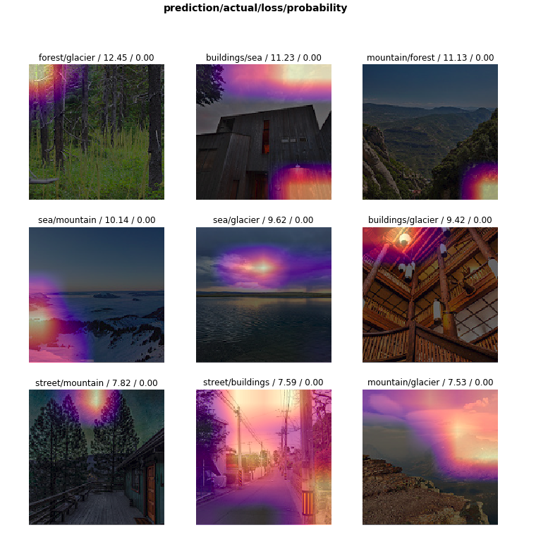
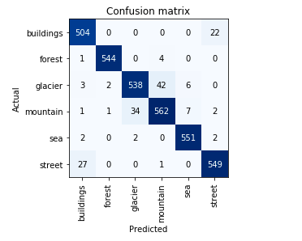
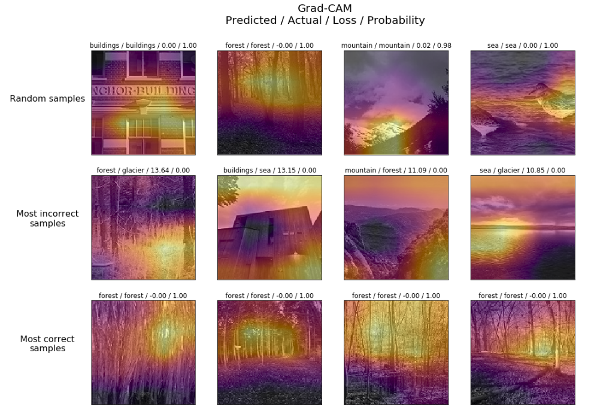
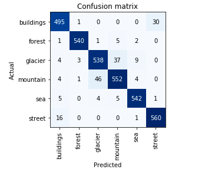
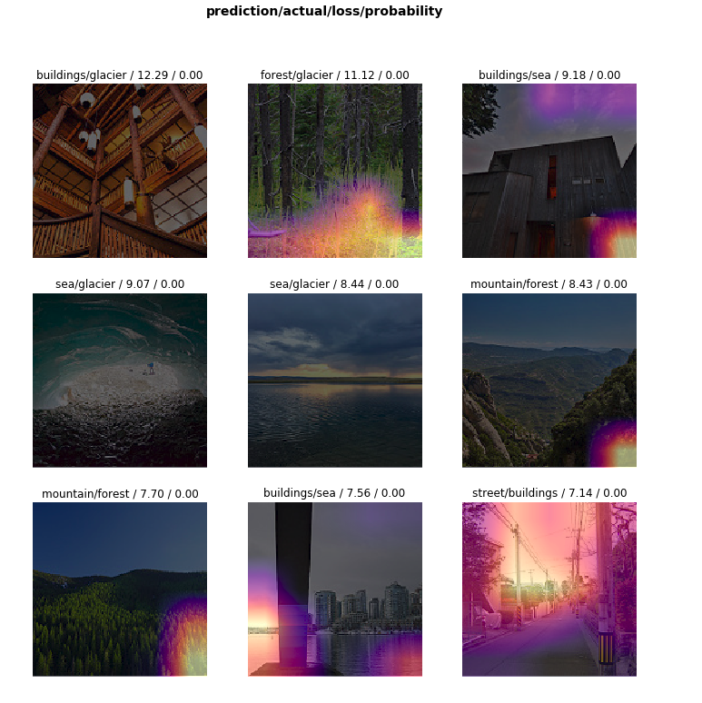
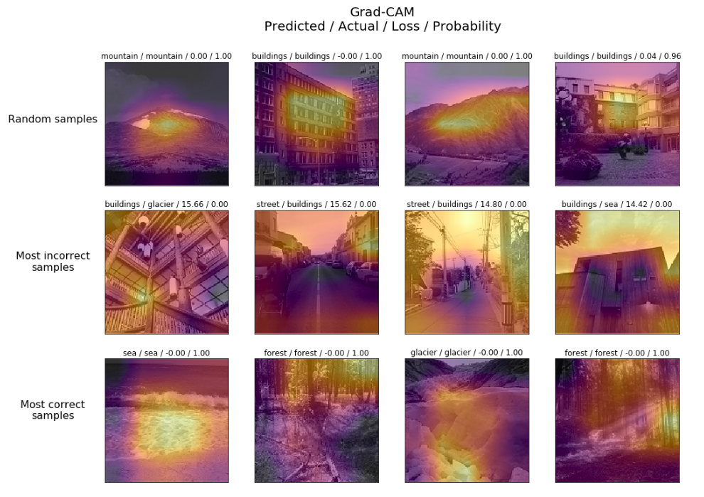

### AUTHOR : RISHI SHARMA  7th Rank on Public Learderboard | 12th Rank on Private Leaderboard
 ## Username : rishi34

[Private Learderboard](https://datahack.analyticsvidhya.com/contest/practice-problem-intel-scene-classification-challe/pvt_lb)

[Public Learderboard](https://datahack.analyticsvidhya.com/contest/practice-problem-intel-scene-classification-challe/lb)


[Competition Link](https://datahack.analyticsvidhya.com/contest/practice-problem-intel-scene-classification-challe/)

#### Problem Statement
How do we, humans, recognize a forest as a forest or a mountain as a mountain? We are very good at categorizing scenes based on the semantic representation and object affinity, but we know very little about the processing and encoding of natural scene categories in the human brain. In this problem, you are provided with a dataset of ~25k images from a wide range of natural scenes from all around the world. Your task is to identify which kind of scene can the image be categorized into.

#### Dataset Description

There are 17034 images in train and 7301 images in test data. The categories of scenes and their corresponding labels in the dataset are as follows -
```
'buildings' -> 0
'forest' -> 1
'glacier' -> 2
'mountain' -> 3
'sea' -> 4
'street' -> 5
```
- There are three files provided to you, viz train.zip, test.csv and sample_submission.csv which have the following structure.

| Variable	| Definition |
| ------------- | ----------------- |
| image_name	| Name of the image in the dataset (ID column) |
| label | Category of natural scene (target column) |
 

- train.zip contains the images corresponding to both train and test set along with the true labels for train set images in train.csv

#### Evaluation Metric
The Evaluation metric is accuracy.

### Models
Following models are used :

- ResNet 50 pretrained on ImageNet(Fast.ai)
- DenseNet 201 pretrained on Imagenet(Fast.ai)
- ResNet 152 pretrained on Imagenet(Fast.ai)
- ResNet 34 pretrained on Imagenet(Fast.ai)
- ResNet 101 pretrained on ImageNet(Fast.ai)
- ResNet 50 pretrained on ImageNet(Keras)
- ResNet 101 pretrained on ImageNet(Keras)
- ResNet 152 pretrained on ImageNet(Keras)
- SE-ResNeXt 101 pretrained on ImageNet(Keras)
- ResNet 50 pretrained on [CSAILVision places365](https://github.com/CSAILVision/places365) scene classification dataset.

I have used Fast.ai library, it provides easy to use new cutting egde techinques like cyclic learning rate, learning rate finder, etc.

Cyclic learning rate helps to achieve really good score in less number of epochs.


There is a fundamental difference between object classification and scene classification. In object detection our model tries to find an object, so if we look at Class Activation Mapping (CAM) on this model then we can see that it focuses on one point (perticular portion of an image where the object is). Where else in scene classification, scene is covering the entire image, this model takes into consideration the entire scene and we can see that in CAM of Places 365 pre trained model.

The problem with imagenet pretrained models is that they are trained on object classification dataset, so it becomes tough to fine tune (train all layers) the model and get improved result than what we get from just training last layers of the model in scene classification task, it might take lots of epoch to get better result. That's why ResNet 50 pretrained on Places365 works really well in this task, and this model gives  best validation accuracy.


### Image Augmentation

Used these augmentation
- Random cutout
- Rotation
- Horizontal flip 
- Brighness
- Vertical flip
- Shear
- Random Zooming
- Random Cropping
- Brightness change

Image example with augmentation


### Results

|model|Val Acc| Val TTA Acc |  Info |
|-----|-------|-------------|-------|
| [ResNet 50 places](resnet50/resnet-50-places.ipynb) | 0.9533 | 0.9506 | first trained on img size 75, then trained on img size 150 |
| [ResNet 50](resnet_50/resnet-50.ipynb) | 0.9463 | 0.9445 | first trained on img size 75, then trained on img size 150 |
| [ResNet 101](resnet_101/resnet-101.ipynb) | 0.9472 | 0.9454 | trained on img size 150 |
| [SE ResNext 101](se_resnext101/se_resnext101.ipynb) | 0.9436 | 0.9507 | trained on img size 150 |
| [Ensemble](ensemble.ipynb) | - | 0.9554 | average of probabilities of all model for each class |

- I have used Test time augmentation for final submission.
- Took average of probabilities of all model for each class.

- private LB Accuracy score - 0.9544

#### Ensemble model


---
#### ResNet 50 Imagenet



Class activation mapping (CAM), top losses


---
#### ResNet 50 Places 365



Class activation mapping (CAM)


---
#### ResNet 101 Imagenet



Class activation mapping (CAM), top losses


---
#### SE ResNeXt 101 Imagenet


Class activation mapping (CAM)


---

### Folder structure

```
.
└── intel-scene-classification
    ├── ensemble.ipynb
    ├── resnet_101
    │   ├── resnet-101.ipynb
    │   └── ...
    ├── resnet50_places_progressive_resizing
    │   ├── resnet-50-places.ipynb
    │   └── ...
    ├── resnet_50_progressive_resizing
    │   ├── resnet-50.ipynb
    │   └── ...
    ├── se_resnext101
    │   ├── se_resnext101.ipynb
    │   └── ...
    ├── input
    │	├── images
    │	├── test.csv
    │	└── train.csv
    ├── images
    │   └── ...
    ├── sub.csv
    └── README.md


```

### Run

1. Create one folder named `images` in `./input/images/`
2. Now put all the images in this folder `./input/images/images/`

3. Keep the train file in input folder as it is, I have added one column named `valid` which shows which images are validation images.

4. I have used 4 model architectures,
 - To run ResNet 50, go to `./resnet_50_progressive_resizing/` and run [resnet-50.ipynb](resnet_50_progressive_resizing/resnet-50.ipynb) file.

 - To run ResNet 50 places 365 model, go to `./resnet50_places_progressive_resizing/`  and run [resnet-50-places.ipynb](resnet50_places_progressive_resizing/resnet-50-places.ipynb) file.

 - To run ResNet 101, go to `./resnet_101/` and run [resnet-101.ipynb](resnet_101/resnet-101.ipynb) file.

 - To run SE-ResNeXt 101, go to `./se_resnext101/` and run [se_resnext101.ipynb](se_resnext101/se_resnext101.ipynb) file.

 - All of these notebooks will generate output files for validation probabilities, and test probabilities in their respective folder.

5. To get the final submission,
 - Final model is simple average of probabilities of all 4 models Test time augmented output on test images.
 - Run [ensemble.ipynb](ensemble.ipynb) to get final submission, predictions on test data will be saved as `sub.csv` .
 - Here this notebook takes `test_probs_tta.csv` from all the model folders and average the probabilities.


